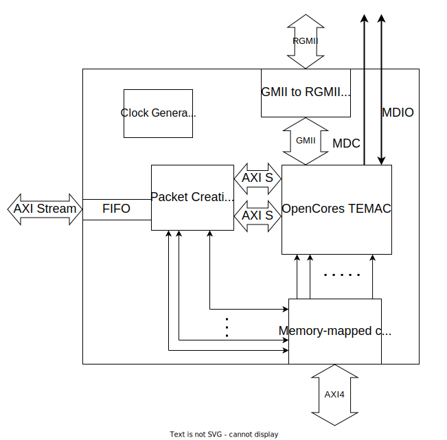

Gigabit Ethernet Media Access Controller
========================================================

## Overview
This repository contains a Chisel generator used to instantiate a run-time configurable Gigabit Ethernet Media Access Controller (GbEMAC) written in [Chisel](http://www.chisel-lang.org) and Verilog HDLs. The Ethernet Controller is used for transferring data from an FPGA-based board with an Ethernet port to a PC, using UDP IPv4 protocol for data transfers. For the implementation of some parts of this module, open-source OpenCores' [10_100_1000 Mbps tri-mode ethernet MAC](https://opencores.org/projects/ethernet_tri_mode) block is used, modified and upgraded. More information about the GbEMAC module can be found among the proceedings of [2021 IcETRAN international conference](https://www.etran.rs/2022/zbornik/ICETRAN-22_radovi/038-ELI1.1.pdf).

### GbEMAC Implementation

The implemented design of the gigabit Ethernet media access controller is relatively complex. It has several interfaces and, in general, it can be divided into four mutually connected submodules, with some of them communicating with the outer world as well. GbEMAC has AXI4 interface for for accessing memory-mapped configuration registers, AXI-Stream interface input interface for receiving the data that are needed to be sent to the PC, Reduced Gigabit Media-Independent Interface (RGMII) used for communication with an external Ethernet transceiver chip and four different input clock signals for different clock domains: 125 MHz clock signal for RGMII interface, 125 MHz clock signal shifted for 90 degrees for RGMII interface, clock signal for external Ethernet transceiver chip configuration and global clock signal. GbEMAC's submodules are the already metioned OpenCores Tri-mode Ethernet Media Access Controller (TEMAC), the GMII to RGMII converter, the memory-mapped configuration registers module and the packet creation submodule. TEMAC's main function is to convert streaming data-to-be-sent from the input streaming native interface to the output GMII interface and data-to-be-accepted from the input GMII interface to the output streaming native interface, and to configure the external Ethernet transceiver chip. The GMII to RGMII converter adapts the GMII interface signals to the RGMII interface signals, thus reducing the number of occupied output pins and switching from the single data rate (SDR) to the double data rade (DDR). The memory-mapped configuration registers can be accessed using AXI4 interface. Using them user can access configuration and control registers, and change the value of things like IP or MAC addresses, data packet size etc. and control the data transfer process. All the relevant registers with their addresses are provided in the following paragraphs. The packet creation submodule is responsible for implementing all the network abstraction layers and protocols in the design. It wraps the data arrived from the streaming interfaces with the appropriate header and calculates all the values for the header fields. It also accepts data packages arrived from the network and checks if they are addressed to this module and creates and sends the response if it is needed. A block diagram of the implemented module with its submodules and interfaces is shown below.

For the design to work properly, a set of appropriate values should be written into the memory mapped configuration and control registers and the external Ethernet transceiver should be configured. The list of relevant registers with their descriptions and address offsets is provided below.

|                        Content                        |                           Address offset                          |        Size[bits]        |
|:-----------------------------------------------------:|:-----------------------------------------------------------------:|:------------------------:|
|    PHY address of the ethernet transceiver device     |                                0x00                               |             5            |
| Address of the register inside the transceiver device |                                0x04                               |             5            |
|    Data to be written into the transceiver register   |                                0x08                               |            16            |
|    Write into the specified transceiver register      |                                0x0C                               |             1            |
|   No preamble for the MDIO interface transactions     |                                0x10                               |             1            |
|      MDC clock divider (freq = 5MHz/divider)          |                                0x14                               |             8            |
|      Ethernet speed (should equal 4 for gigabit)      |                                0x18                               |             3            |
|            Full duplex bus (should equal 1)           |                                0x1C                               |             1            |
|                  Size of TCP packets                  |                                0x20                               |            16            |
|           Higher bytes of source MAC address          |                                0x9C                               |            24            |
|           Lower bytes of source MAC address           |                                0xA0                               |            24            |
|                  Source IP address                    |                                0xA4                               |            32            |
|                  Source port number                   |                                0xA8                               |            16            |
|        Higher bytes of destination MAC address        |                                0xAC                               |            24            |
|        Lower bytes of destination MAC address         |                                0xB0                               |            24            |
|                 Destination IP address                |                                0xB4                               |            32            |
|                 Destination port number               |                                0xB8                               |            16            |

All the source files are stored either in the `verilog` or the `chisel` directory. The `chisel` directory contains a Chisel project used to generate the already mentioned memory-mapped configuration registers and the wrapper module that can be used for possible integration in further Chisel projects. The `verilog` directory contains all the other source files used for the implementation of the GbEMAC module, including a simple example of its instantiation in a larger system.

The `scripts` directory contains various scripts that allows the GbEMAC module to operate correctly. The files in this directory are the following:
* `scripts/rx_udp.py` - An example script used for simple data receiving on the PC side, using the Python socket library.
* `scripts/vivado_components.tcl` - A script used to instantiate Vivado IP blocks used in the design for the clock signal generation and the AXI4 bus access using JTAG.
* `scripts/temacConfig.tcl` - A script used to configure the GbEMAC module by writing appropriate values into the memory mapped configuration registers, and to configure the external Ethernet transceiver chip.
